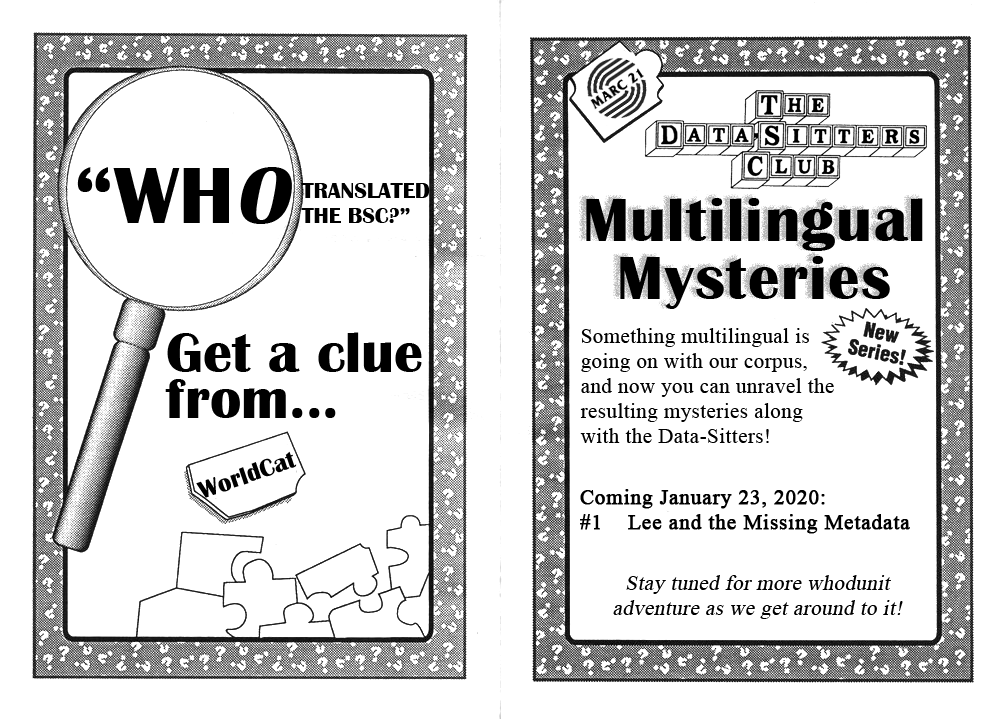

# The Latest from The Data-Sitters Club

[DSC #1 - _Quinn's Great Idea_]({{ site.baseurl }}/dsc1/) (11/07/2019)  
[DSC #2 - *Katia and the Phantom Corpus*]({{ site.baseurl }}/dsc2/) (12/12/2019)  
[DSC #3 - *The Truth About Digital Humanities Collaboration (and Textual Variants!)*]({{ site.baseurl }}/dsc3/) (01/10/2020)

## Multilingual Mysteries (New series!)

[DSC Multilingual Mystery #1 - _Lee and the Missing Metadata_]({{ site.baseurl }}/dscm1/) (1/23/2020)

