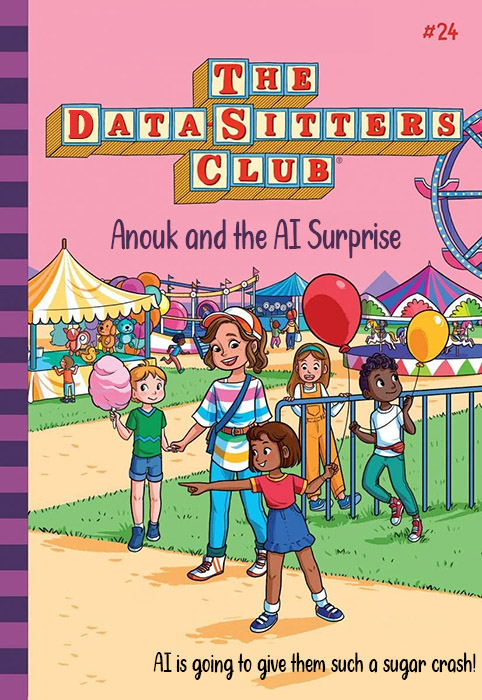

```{index} single: *Book Topics ; AI ethics & issues (DSC 24)

```

by Anouk Lang, Lee Skallerup Bessette, and the Data-Sitters Club

April 23, 2026




> This is Just To Say
>
>
>I have turned off<br />
>the AI features<br />
> that were in the update<br />
>
>and which<br />
>you were probably<br />
>hoping<br />
>to monetize<br />
>
>Fuck you<br />
>they were stupid<br />
>so unnecessary<br />
>and so annoying<br />
> -- Kelly Link, April 20, 2026, [on Bluesky](https://bsky.app/profile/kellylink.bsky.social/post/3mjxcyfnwxc2f)

## Lee

*This is Lee. Are you as tired about talking about and dealing with AI as I am? As an academic technologist, my whole professional life has been taken over by “the AI conversation”. How can we stop students from using it? How can I AI-proof my course? HOW WILL STUDENTS LEARN?!?!?!?!? It’s only one conversation, and it’s not one that’s going to get answered to anyone’s satisfaction. But if I am going to have ANOTHER conversation about AI, I can think of no one I’d rather have it with than DSC. Imma pass this off to Anouk, because she’s been thinking about all of this WAY more critically than I have been able to.*

## Anouk

Anouk here. Your friendly, neighborhood data-sitters held a meeting to discuss the topic *du jour*: artificial intelligence. Chaos, ambivalence, a lot of grousing, and a few good insights ensued. (Katia, a noted grouser on this topic, adds that we have cut much of the grousing for your ease of reading. You’re welcome.) 

There is a really basic but important insight from STS scholarship, I told my friends, which is that AI is not a singular *thing*. It makes no sense to just talk about “AI”: you need to specify which of its different manifestations you are talking about, unfold that into the many complicated assemblages in which it is situated, think about the processes that have gone into making those, which in turn involves understanding not just the computational processes going on under the hood but also the histories which constitute their development. 

There is a really basic but important insight from STS scholarship, I told my friends, which is that AI is not a singular thing. It makes no sense to just talk about “AI”: you need to specify which of its different manifestations you are talking about, unfold that into the many complicated assemblages in which it is situated, think about the processes that have gone into making those, which in turn involves understanding not just the computational processes going on under the hood but also the histories which constitute their development. 

(Here you can imagine[ ex-British prime minister Boris Johnson's dopey enthusiasm](https://www.youtube.com/shorts/JAVMEs5CG1Y) for AI, which is how we like to put the requisite verbal scare quotes around the term in my house. Truly, as Tressie McMillan Cottom puts it, [AI is "mid tech"](https://www.nytimes.com/2025/03/29/opinion/ai-tech-innovation.html).)

“Is it really that difficult?” Roopsi asked. “To understand that there is a general term and then there are a whole lot of ways it manifests in different tools and work flows? Artificial intelligence more or less means systems that can carry out tasks that would otherwise require human cognitive processes. Natural language processing helps computers understand ‘human’ language. Machine learning learns from data and finds patterns. Generative AI creates content from patterns in data sets. And, especially for people who are angry or suspicious about generative AI, there has been so much effort to investigate!” 

There really have been. Accounts, published by major trade presses, have begun to emerge from investigative journalists and whistleblowers about what goes on behind the closed doors of corporations making the key decisions about building, training, funding, shaping and hyping large language models and neural networks, and the often shocking fallibility of the humans making them. I was aware of Timnit Gebru and Margaret Mitchell's firing from Google, and had read their [Stochastic Parrots paper](https://doi.org/10.1145/3442188.3445922), but I didn't know the details of how these events were connected, and the specifics of anti-Black and misogynistic attempts to discredit their work, until reading Karen Hao's account in [Empire of AI](https://www.penguin.co.uk/books/460331/empire-of-ai-by-hao-karen/9780241678923). Sarah Wynn-Williams' jaw-dropping account of working at Facebook, [Careless People](https://read.macmillan.com/fib/careless-people/), finishes mostly before the AI race ramps up, but her repeated descriptions of how profits and personal gain were prioritized over safety and ethical concerns is an evergreen reminder that, to misquote[  Quinn and The Trouble With Environments](https://datasittersclub.github.io/site/dsc21.html), tech companies are people.

None of this is news to folks in DH, digital sociology, and those working on [fairness, accountability, and transparency from within computer science](https://facctconference.org/), of course. Since the 2010s there have been no shortage of critics pointing to the downstream problems with algorithmic and machine learning technologies, including but not limited to [Safiya Noble](https://nyupress.org/9781479837243/algorithms-of-oppression/), [Joy Buolamwini](https://www.penguinrandomhouse.com/books/670356/unmasking-ai-by-dr-joy-buolamwini/), [Shoshana Zuboff](https://profilebooks.com/work/the-age-of-surveillance-capitalism/), [Kate Crawford](https://yalebooks.co.uk/book/9780300264630/atlas-of-ai/), [Cathy O'Neil](https://www.penguin.co.uk/books/304513/weapons-of-math-destruction-by-oneil-cathy/9780141985411), [Meredith Broussard](https://direct.mit.edu/books/book/3671/Artificial-UnintelligenceHow-Computers), [Emily Bender and Alex Hanna](https://www.penguin.co.uk/books/468070/the-ai-con-by-hanna-emily-m-bender-and-alex/9781847928610). But also knowing some of the human stories behind what has gone into shaping tech companies' decisions---from ostensibly small things like the layouts of offices and the names chosen for conference rooms, to more obvious moments like Mark Zuckerberg's fury when taken to task by Barack Obama for allowing misinformation about the election to circulate on Facebook, and the horrifying human costs of the data labelling and content moderation work that is outsourced to poorly paid workers in the Global South---along with insights into the habitus of a world that is very far from the one most of us live in is illuminating, both for what it reveals of the many flavors of hubris underpinning tech bro culture in Silicon Valley and for what we can learn about how this hubris plays out in the sociotechnical assemblages around the machine learning and algorithmically driven technologies that get collectively lumped into the manifestly inadequate coinage of "AI".

### AI and the post-truth world

Amidst the AI-driven existential crises rising to the surface of a thousand anguished Substack thinkpieces, I have found myself wondering what my tolerance is for living in the post-truth world. And I discover that actually, I have no tolerance for it at all. It turns out I really need people's words to mean something, and it is disorienting when they don't.

"Hear, hear!" interjected Katia.

In the context of the classroom, this has manifested itself in what feels like the breaking of a contract. As teachers we invest time, energy and often a substantial part of ourselves in helping students learn, by thinking hard about how to design a course, talking enthusiastically about things we consider important, opening up space for students to practise thinking out loud, and giving them individually tailored feedback which they can use to improve. A lot of energy goes into it, and, for me at least, a lot of personal satisfaction comes out of it. In return, students agree to show up and sincerely engage with the materials in front of them. Once robots enter into the equation as proxies for enacting a performance of that sincere engagement, something is broken, and that's before we even get to [the](https://www.brainonllm.com/)  [cognitive](https://bera-journals.onlinelibrary.wiley.com/doi/abs/10.1111/bjet.13544)  [deskilling](https://papers.ssrn.com/abstract=5082524)  [part](http://doi.org/10.1145/3706598.3713778). Giving feedback is a laborious process, and putting time, care and sincere effort into it when the work has been partly or entirely done by a machine feels like a travesty. (And enough already with the jokey proposals that AI can do our grading. An AI chatbot is a mechanism for generating tokens according to the statistical patterning of language in its training data. Yes, it produces a remarkably realistic pastiche of feedback. No, it cannot do your grading.)

The argument you sometimes hear at this point is that students are stressed and anxious and have so little time these days to devote to academic work because they are also working (as if those of us now in academic posts somehow sailed through our own student years entirely untroubled by the pesky business of paying rent and buying groceries). Shouldn't we be thinking about those much bigger problems instead of laying the blame at AI's door? Sure, but while we wait for the structural inequities of disaster capitalism to be overturned, we might want to take on the somewhat more contained task of finding ways to design out the kind of digital mediation that lends itself to AI-facilitated cheating. I get that if someone struggles with writing essays, maybe because their prior educational experiences have not prepared them well for that, but also maybe because it is too much like hard work, it's difficult to resist the temptation of a machine that will do it for them. Add to this the perception, which I've heard students articulate more than once, that if they don't use ChatGPT they'll be putting themselves at a disadvantage compared to their classmates who are using it. So there are plenty of short-term incentives to let the robots do the heavy lifting. But what I find especially dismaying is that the outsourcing of a whole generation's thinking and writing to a machine goes beyond cognitive deskilling to the passing-up of an opportunity---getting a university education---that is a huge privilege and, in the UK at least, one that is not yet (entirely) contingent on one's class position. So, along with the rupturing of the contract between teacher and student, I find it distressing to contemplate the long-term social impacts of reliance on generative AI, and the potential fraying of one of the vectors of social mobility. But perhaps I'm just hopelessly naive, and I should just get used to living in the post-truth, slopaganda-filled, brain-rotted world where the quaint notion of lying has been replaced by [Harry Frankfurt's notion of bullshit](https://web.archive.org/web/20250201061311/https://www2.csudh.edu/ccauthen/576f12/frankfurt__harry_-_on_bullshit.pdf).

"Since I've been put in the position of leading a subcommittee on AI and pedagogy at my institution," Roopsi piped up, "I keep encountering people who are very angry because students are using LLMs to complete their course assignments. They say they know how to fix this --- smaller classes, computer labs where students can write during class without internet access, blue books... Writing jail. They want writing jail. I just don't even know what to say." 

Writing jail didn't sound like such a bad idea to me, given all the shiny, ping-y distractions that---long before AI was sucking the air out of English department meetings---computers put in the way of unlocking that flow state where writing and thinking happens. And this idea of helping students to connect to their ideas by taking out the mediating interfaces that stand in the way is something I've found especially useful in figuring out what to do about generative AI in my own classroom. It's taken some time and thought, but in those courses whose learning outcomes and assessment I have control over, I've found ways to design out the places where products stood in for processes, set up structures to motivate students to meaningfully connect with each other and with me in non-mediated ways, foster a reflexively critical attitude to what gets excreted by an AI chatbots (not *what answer does it give me*? but *why might it have strung the tokens together that way*, and [*what might be in its training corpus?*](https://cuny.manifoldapp.org/read/putting-the-friction-back-in-3ba9166c-5c71-43ac-badf-a47d52c5f6c6/section/38820136-96c5-452c-ba35-b49468be6c94)), and construct assessments that ask students to use a range of genres, and adopt a variety of rhetorical positions, to help them to see their writing as a craft, and something in which they can take pride. And one delightful thing that's emerged is that my courses are now, as a result, a great deal better. Students are more engaged in discussions and enthused about the material, the quality of the work they submit has improved, and they are getting practice at producing a wider range of genres. I have to spend more time on some aspects of my teaching, but not to a burdensome extent, as some of that work can be automated. Plus the difference between a class that whizzes by because everyone has something to say, compared to the painful dragging of a two-hour seminar in which no one has done the reading is a trade-off I am 1000% happy to make. The process of AI-proofing has turned out to be a side benefit of something much more thoroughgoing: I should have burned my courses to the ground and built them back up years ago.

Thinking in retrospect about this redesign process, I see that at its heart is the desire to preserve something that in the neoliberal university is increasingly difficult to hold on to: the importance of the social. Learning, when it works best, is deeply relational, and involves community, and we've written about [how this works for us in the DSC](https://journals.publishing.umich.edu/jep/article/id/6093/). The problems gen AI poses for university teaching didn't start with ChatGPT: many go back to the introduction of mediating interfaces between us and our students. Gen AI just magnified those problems to the point where they could no longer be ignored, showing for instance that plagiarism detection software was always a manifestly inadequate approach to cheating, and no substitute for thoughtful activities integrated into the curriculum designed to induct students into an intellectual culture of reading and referencing external sources so as to equip them to enter into critical conversations themselves. But attempting this sort of thing in undergraduate survey courses, as the tech folks say, does not scale: if you have an overwhelming number of students then building relationships with them, and doing the painstaking work of teaching them search literacy and bibliographic skills takes more time than most of the people tasked with doing that teaching have. Hence the allure of technosolutions like TurnItIn or charlatan start-ups claiming to students and teachers alike that their product will let you use AI to detect AI. (Sigh. No. Again, say it with me: tokens, statistical patterning, training data, pastiche.)

So, thinking about where I've had the most success in AI-proofing my teaching, and making it better and stronger across the board, I find that it's where I've taken it back to relational imperatives. Where there is group work, for instance, there are steps that can be taken to make students more accountable to each other, so they actually meet rather than copying and pasting slop into a shared doc then attempting to blag their way through it in class as if it came from their own brain. Starting from an understanding of what students find difficult about group work and what might be at stake for them socially, you can first establish working relationships between group members while they are physically present in the classroom, put people on notice that there will be an accountability mechanism, build in scaffolding tasks which are mostly easily done by meeting in person, then tie the assessment to delivering their material live in class and answering questions in person. Every time I've dragged an assessment away from the screen it's led to much more engaged conversations in class, to the point where sometimes all I need to do is to ask the right opening question, and the discussion then runs itself. And the wonderful thing is that I can see -- and students also tell me afterwards -- that they have a better time, not only because there are lively discussions about the texts and authors but also because they become more connected with each other. Making friends might sound like a side benefit, but I've come to understand it as central to the success of what goes on pedagogically. More than once, groups got on so well that they all decided to go to the pub after the last class, which felt like a massive win. I wrote so many more references for students in my AI-proofed classes, and I also noticed that more of them kept in touch after graduation, so I have a better sense of what they have gone on to do afterwards, which is one of the perks of my job. It brings me joy to know that some have gone on to excellent master's programmes, and some by now to PhDs.

“The creation of community is so important,” Katia said. “In my small classes, this sense of community forms through our in-class activities and discussion, but in my larger classes, some of which are taught online, breaking students into small groups with which they regularly meet, learn, and discuss throughout the term enables this level of close engagement. I may be naively idealizing, but I have observed that, when there is that human relational element in place, my students are less likely to use gen AI. Many of them have mentioned to me that they find using it in group discussions disrespectful to each other. This seems also to translate to more engagement and less gen AI usage on their individual assignments, which often emerge from critical thinking around and expansion of points brought up in discussion. I really appreciate the connections that form between students in my classes, through this sense of community that is fostered in the classroom, whether in-person or virtual, and the way gen AI is largely met with hostility and skepticism within that community.”

Here in the DSC we are a bunch of people who share a broad overarching alignment with digital humanities, but whose commitments to different technologies in our various institutions shake out in very different ways. (Listening carefully at this point in our meeting, you might have heard the soft click of Quinn's knitting needles, the whirr of their yarn winder or the furry buzz of their 3D printer in the background.) While none of us are giving up computers any time soon, we've also experienced the ways that screens can lead us to become more estranged from our students, and we're hardly alone in that. No one had a choice about that during Covid, but as universities gradually returned to face-to-face teaching, I often heard both colleagues and students expressing relief at being back in the room together: tech might have helped to hold everything together (other than our collective sanity), but the pandemic was a reminder of how good it feels to step away from it sometimes. Now, as waves of AI slop break with increasing intensity over humanities departments in the latest development in our ever-exciting permacrisis, it's somewhat dispiriting to hear people proposing solutions involving more digital mediation: proctoring software (which as Lee reminds me is "literally [cop shit](https://jeffreymoro.com/blog/2020-02-13-against-cop-shit) that runs on [racist and sexist](https://www.frontiersin.org/journals/education/articles/10.3389/feduc.2022.881449/full) and [ableist](https://hybridpedagogy.org/our-bodies-encoded-algorithmic-test-proctoring-in-higher-education/) AI"), logs "proving" a piece of writing has gone through drafts (yep, definitely something that would be beyond the capacity of AI agents to fake), and, of course, using AI to detect AI (which I have to explain so often is Not A Thing that I should get badges made). More money into the pockets of ed tech, and more data into training banks, too. (We should all be doing Tressie's assignment where she asks students ["to figure out what their data rights are"](https://www.nytimes.com/2025/08/12/opinion/ai-college-classrooms-chatgpt.html).)


It's more than a little ironic to be the digital humanist in the rooms where these conversations happen. When some new piece of tech crosses my desk my approach is usually to try it out, in the spirit of figuring out whether it's useful for research or teaching, and also because it just feels like a collegial thing to do as the resident DH-er in my department in case it can help others. This is never about using whizzy tech for the sake of using whizzy tech, but to streamline admin so I have more time for more interesting things and make learning more inclusive and accessible. And it needn't be especially whizzy, either: Google Docs are hardly new, but they are a way to include students for whom speaking in class is a challenge, but who can still participate in discussions by contributing to a shared document. And this willingness to try out new tech (while discarding what is useless/creepy/predatory/extractive) isn't at all incompatible with a commitment to opening up more ways for students to engage with texts and ideas in digitally unmediated ways. Here: shut your laptops, take this piece of paper, and freewrite for a sustained period on a topic that you fear you don't know nearly enough to articulate an argument about. And if I (gently, courteously, and annoyingly) stand behind you to force you to keep writing, to get you over the hump of discomfort where you'd usually ctrl-tab over to Insta or TikTok, you might surprise yourself not only with how much you actually know, but also with discovering the pleasure that comes from flow. 

[*The Gutenberg Parenthesis*](https://www.bloomsbury.com/uk/gutenberg-parenthesis-9781501394829/) by Jeff Jarvis isn't a book that I agree with unreservedly, but its overall provocation is perhaps interesting to think about in this context. Jarvis argues that we're used to talking about the invention of the printing press and the changes it subsequently wrought in terms of a revolution. But instead, we should be thinking about it as a parenthesis, ie. a blip in between oral culture and digital culture, because the stability of print is actually really weird. In oral cultures, information shifts and mutates as it circulates, which is what we also see happening as we move away from a print-centric towards a digital-centric information economy and world. My angst over being made to live in the post-truth world might be more about coming to terms with a world in which the stability of print is revealed as illusory, in other words. Even if you have a print text, there'll likely be one or more digital versions of it, and those can easily mutate and multiply as they circulate. Understanding the wider arc of book history and print culture and how the reconfiguration of print is connected to changing understandings of authority is part of what we need to come to terms with as educators. It can be hard to draw literary people's focus from the text to the medium, unless they're already thinking about print culture and book history: the stigma around "media studies" continues, absurdly, to be a powerful one in the UK. So, depending on the tolerance within one's institution for taking information literacy and the study of media ecologies seriously, there may or may not be an appetite for embedding these topics in a curriculum that already has a lot of material to squeeze into a small space. But if we understand our jobs as humanities scholars as being, in part, to help our students and our readers assess the extent to which information sources and analytical modes are trustworthy, going back to these pre-digital ways of teaching, assessing, and understanding feels like less of a luddite throwback and more in line with this idea of print as a parenthesis in the longue durée of our information ecologies.

Another piece of the puzzle that is missing is actually talking to students about how they use gen AI-powered applications, and how they fit into the other digital ecosystems through which they run their lives and do their work. Basic usability, in other words. These conversations are always interesting, especially if the person you’re talking to isn’t in your own classes or at your own institution, and every time I do it I learn a huge amount about cultures of AI usage (and attempted concealment of AI usage) among different demographics. This extends back to secondary school: students at the start of their secondary schooling use it very differently from those just a few years older. Last time I overheard a conversation along these lines I was struck by the way AI is perceived to be inseparable from the internet, which makes sense if you are a kid who has only ever experienced an internet awash with slop and brainrot. One approach I like to take is to ask students not what they use it for but what their friends use it for. That way they don’t feel like they’re admitting to wrongdoing, and they can share what they feel comfortable with in a way that doesn’t involve implicating themselves. And the students I’ve encountered have a real hunger for talking about these fraught and complex technologies with people who can give them the bigger picture.
 
From these conversations, plus watching a slew of videos which, with adorable naivety, claim to show you how to use gen AI to do your academic work while concealing the fact that you’ve done so, I’ve learnt that a) there is nothing students will not attempt to use AI to do, and b) this can co-exist quite comfortably with disavowing the use of AI, and knowing all the right things to say about environmental degradation, the unrecompensed appropriation of artists’ and writers’ work to train models, and other egregious effects of AI hyperscaling that are by now widely known. This will be a surprise to no one of student age, and it wasn’t news to me: what is surprising, though, is the extent to which many who teach don’t always appear to realize quite how thoroughly gen AI in its many instantiations is now stitched into the fabric of the everyday lives of those in their classrooms. This goes beyond the now clichéd observations that things like spellcheckers, Grammarly and automatic translation blur the line between acceptable tech use and AI interference, as well as the ways that gen AI is now integrated into so many applications that even users who are actively trying to avoid it have little choice, eg. Copilot in Microsoft products, Gemini in Google docs, the AI summaries that appear unbidden at the top of Google results (though that last one at least has an easy fix: add -ai to your search query to turn it off). My point is not about the increasing unsustainability of drawing a distinction between using AI and avoiding it, but rather about immediacy and habituation. If your experience of the world and other people is mediated to a significant extent through devices, at some point AI becomes like the wallpaper, as you simply stop noticing its presence. I don’t kid myself that I have anything but the most superficial of understandings of how a very small n of school- and university-age students use a very small slice of technologies associated with generative AI at a very specific moment in time. But the broader point still holds: actually talking to people about how AI features in their lives and their academic work is one of the avenues we can pursue in order to do the work of unfolding “AI” from the assemblages in which it is enmeshed and which it acts to constitute, with which I began. And that unfolding is, in turn, important if we want to disrupt the rhetorical manoeuvres tech companies use to present this set of heterogenous technologies as a hegemonic, singular juggernaut whose onward motion no one can or should be attempting to stop.

Here’s an example. At a Thanksgiving gathering some time ago, I got chatting to the 16-year-old son of one of the guests, and I asked him what humanizers he and his mates were using these days. He was surprised that I, an old person, knew about humanizers, and was at first a little sheepish about admitting he used them. But I had no power whatsoever over his grades and no personal investment in how well he was writing or learning, and as we talked he gradually opened up about how he and his friends were using these tools, and how he rationalized his decision to use them to do his coursework for him. I was grateful to him for his candor, because I’m better placed to design writing assessments and the activities that scaffold them at university level if I have some idea of how schoolkids are using gen AI, and the kinds of cognitive corners they might be cutting that need to be taken into consideration when those students get to university. When they arrive in my first year classes, I want to gently extract them from those untrustworthy information ecologies that leave them open to the influence of misinformation, and from the mediated environments that are perhaps not great for their mental health, and induct them into different modes of intellectual enquiry. I want to help them discover the pleasures of animated discussions with other smart and intellectually hungry young adults about longform writing, using theoretical lenses that are best encountered in the form they were originally crafted, ie. as essays written by critics, rather than probabilistically-generated “explain it to me as if I am 5” summaries that not only turn complex ideas into predigested pap but also rob readers of models of how to unfold an argument. And to do that I need to have a handle on what students are outsourcing to robots, in order to design classrooms, activities and assessments where what is vulnerable to outsourcing isn’t loadbearing in terms of assessments, rather than setting my time on fire to police and punish that outsourcing where it has happened after the fact. 

There are many bigger and more intractable problems that generative AI is causing in places adjacent to humanities departments. I feel for journal editors dealing with the double whammy of a huge rise in AI slop submissions coupled with a marked drop in the number of people willing to review. Elsewhere in the publishing industry, editors are finding [their identities getting spoofed by scammers](https://notesfromasmallpress.substack.com/p/i-did-not-send-you-that-email-about), while over in the legacy media even [the most august institutions](https://www.theguardian.com/books/2026/mar/31/the-new-york-times-drops-freelance-journalist-who-used-ai-to-write-book-review) are getting [suckered in by slop](https://thelocal.to/fallout-from-ai-freelancer-investigation/). Meanwhile, as everyone knows, the environmental ramifications are sobering, the arrogation of potable water to cool datacenters is obscene, and pressure is mounting rapidly on infrastructural systems such as the electrical grid which we should probably try and keep. The overcapitalization problem is particularly offensive because even those people who have never used AI or actively sought to avoid it are at risk of having their savings destroyed by the hubris of the tech oligarchs. I've already mentioned [the terrible toll of content moderation work carried out by precariously employed workers in places far from the labor protections and high salaries enjoyed by many in Silicon Valley](https://www.theguardian.com/technology/2023/aug/02/ai-chatbot-training-human-toll-content-moderator-meta-openai). And then there's the destruction of the legacy media, whose importance to the survival of democracy has never been clearer than in the 2020s. In light of all of this, the slop-ocalypse facing humanities departments in universities begins to seem like it may not actually be that hard. It requires work, sure, but compared to everything else breaking around us, it is a bounded problem that can actually be solved with a little ingenuity, and the willingness to see it as a challenge that might actually make teaching and learning better in the long run. We're not trying to turn the juggernaut of technocapitalism around, after all, though I'd like to think some of my English major students will use their fine critical minds to go into politics, the civil service and the corporate world to help that process on its way. If what we want is to prevent cognitive deskilling and develop reflexively critical attitudes in our students, while keeping the robustness of our assessments and by extension the integrity of our degrees, then there are lots of examples of ways to do this that thoughtful people, many of them digital humanists, have found and shared.


### Et Tu, Humanities?

Here's one idea about how insights from the humanities might be incorporated into conversations about machine learning that are otherwise dominated by those in tech companies and the sciences. Before GPT-3 was publicly released by OpenAI but GPT-2 was available to developers, Quinn and I were pondering whether we could do something simultaneously fun, interesting and critical with it for the DSC. We fine-tuned it with our BSC corpus, and though much of what was produced was terrible ("The front door flew open, and Kristy --- tall, graceful, and incredibly pretty with three legs and the most total body of skin I've ever seen --- burst into the room"), it was very illuminating to watch the specifics of how the outputs improved as the training went on, given our familiarity with the way the books tend to represent characters, depict family relationships, structure dialogue and so forth. This became [DSC #9: The Ghost in Anouk's Laptop](https://doi.org/10.25740/ys319vz9576), and it resonates with my general approach to doing DH work, which is to take some of the analytical methods and critical lenses that have proved to have staying power for the study of literature (or history or art history or whatever your field may be) and find ways to put them in conversation with the results of computational analysis and the outputs of algorithmic technologies. Watching GPT-2 stagger drunkenly to its feet with prose that barely cleared the bar as grammatical, slur its way through everything from, well, slurs, to surreal conversations between multiple Claudias, then gradually sober up to the point where it could actually produce semi-convincing pastiches of Ann M. Martin's writing style has stayed with me as a kind of human-readable analogue of what goes on as a model proceeds through its training, and it's something that I would not have understood without having spent a solid amount of time reading the BSC books with my human eyes, and without the vocabulary of literary analysis at my fingertips. I feel something of an ethical imperative in this respect as someone who translates from the digital to the humanistic and back again: even if I don't much like a particular technology, I feel something of a professional obligation to try and understand it, which involves actually using it a bit, so as to offer a critique that is both humanistically-oriented but also data-literate.

There's a parallel with another of our books, [DSC #11: Katia and the Sentiment Snobs](https://datasittersclub.github.io/site/dsc11.html). With a colleague, Bea Alex, I teach a course on computational approaches to narrative which includes a section on sentiment analysis. This is not because either of us are especially enamoured of it as an analytical approach, but because sentiment analysis is quite self-contained and easy to do, and also because it is a handy thing to use to help students critically appraise the process of putting a score on something as subjective and diffuse as affect. The students do manual sentiment scoring of a story, then automate the scoring with a rules-based engine (TextBlob). We then think together about how the beats of the story, and the way its plotting -- jumping backwards and forwards in time -- might intersect with the way a reader is led to experience the gradual shifts in the narrative, as what starts out as quite humorous is gradually unfurled into something much more sad and poignant. For all its flaws, sentiment analysis works well both as a way of critiquing the very idea of sentiment scoring and also as a lens through which to explore the workings of fabula and syuzhet. It's quite fun, and the fact that TextBlob is so crude is great for the purposes of the class because it makes the critique part easy.

But, as you may know if you've done any kind of sentiment analysis yourself since late 2022, gen AI turns out to be super good at it. When I ran the text we used in class through ChatGPT out of curiosity some years ago, it did a spectacular job with its sentiment scores. And, honestly, I could care less, because sentiment analysis is not really interesting to me as a way of understanding literary texts (though Katherine Elkins has[  some work out there](https://culturalanalytics.org/article/143671-beyond-plot-how-sentiment-analysis-reshapes-our-understanding-of-narrative-structure) that makes the case for it). But here's the thing. A lot of people in the world beyond academia---in fields from marketing to banking and finance and prediction markets and more---are using sentiment analysis to make a whole lot of money, and have been for a while. As the information wars unfold, sentiment analysis engines are merrily monitoring what is being said not just about products and companies but individuals, politicians, election campaigns and so forth, and keeping their finger on the digital pulse of what is capturing people's outrage and attention. And so, even though sentiment analysis has not proved itself especially compelling for the purposes of literary appreciation, it *is* something which lends itself very readily to critical appraisal. Ie. we can take our humanistic expertise---in this case an understanding of genre, register, form, narrative voice, style and so on---and use it to address the question of why machine learning can do this kind of analysis so much more effectively, and with more attention to nuance, than a rules-based approach. Here's one of the things it can do. When you do manual sentiment analysis, you can find yourself in a weirdly artificial reading mode where you start self-consciously interrogating your own interpretive processes. "Do I just code the sentence itself for sentiment, or should I take into consideration what I know about its context? Should I remember what happened in the previous sentence, or earlier in the text? How much earlier? Would a machine remember back this far? What is the context window for the human brain anyway? And how does this change if I had broken sleep and haven't yet had my first coffee of the morning ...?" As a human reader you have control over the extent to which particular aspects of the context should be considered, and because rule-based engines are generally pretty bad at dealing with context, their scores are correspondingly out of whack when compared to those of human raters. But gen AI nails the context, and that makes it really good at doing sentiment analysis. So, though I wouldn't have necessarily elected to investigate the intersection of gen AI and sentiment analysis, it does still feel like meaningful work, in no small part because it connects literary analysis to much bigger, structural systemic forces which have an outsize effect in governing the way the world runs, and how flows of capital operate. I'd like to think that understanding affect by bringing disciplinary knowledge of narratology to bear on the algorithmic processes underlying automated sentiment scoring---as opposed to, say, the way a futures trader might understand 'sentiment' as something that can be channelled and exploited for financial gain---has light to shed not only on how a text can activate human emotions, but also on the workings of gen AI. So that's one example of why literary and humanities scholars are worth bringing into conversations about gen AI, especially those dealing with ways these technologies are being practically applied out in the world.

### Culture and/as Resistance

From all of this, you might wonder whether I'm proposing a neat package of easy solutions for ethical use of gen AI in the humanities: if you don't want it in the classroom then do away with mediating interfaces when you're assessing, and if you use it in your research then make sure you're not just accepting its outputs but interrogating those critically. Of course it's not that simple. Even the idea that we might be able to keep our hands clean from AI---in a world where we're enmeshed in many different technical systems in a host of seen and unseen ways, for instance in the tracking devices we carry with us everywhere and which we can't easily opt out of due to things like the two-factor authentication apps needed to do the most basic parts of our jobs---is a patent fantasy. We're co-opted into systems by the state and by our employers, as well as by the existing communication norms of the communities to which we belong (there's community again!). At this point, AI is like capitalism: as alert as we might be to its problems and the growing inequities it presents, there's no getting outside it and no avoiding its contradictions. But can we resist it, and slow the amount of energy and resources consumed? Absolutely: the social media ban in Australia in late 2025 shows that regulation a) can be done and b) makes a difference. Moreover, it gave momentum and a sense of fresh hope to the 'smartphone-free childhood' movement here in the UK, and it was cheering to see the way it changed the conversation from 'sigh, it's inevitable' to 'wait, we can actually change things and resist what big tech imposes on us' in a relatively short period of time. (As I write this, the UK government has just announced [plans for a statutory ban on smartphones in schools in England](https://www.theguardian.com/politics/2026/apr/20/mobile-phones-statutory-ban-schools-england-bill-amendment): grassroots movements work!) A friend of mine told me about a strategy in her kid's primary school class: one parent offered to buy cheap dumbphones for any kid in the class who wanted one, which had the effect of making it cool to have one. This wouldn't be affordable for everyone, but there are ways to replicate the basic idea. Network effects for the win.

And this brings me back to culture. The more slop-infested essays I read, and the more slop-orific videos I see, the more hopeful I am about the fact that neural nets and large language models cannot make culture. Can they pastiche it? Yes, more convincingly than many humans can. But they are penned within the walls of what has already been invented, and only capable of generating probabilistic repackagings of things that are already in their training data. No deep learning model could have come up with Schoenberg's invention of 12-tone serialism before the early 1920s, or Duchamp's Nude Descending a Staircase before 1912, or Dickinson's poetry before the middle of the nineteenth century. This past semester I got my digital humanities students to think about critical AI literacy by making culture, and they rose impressively to the challenge. (Watch [this space](https://bsky.app/profile/aelang.bsky.social) for more, once grades are in and I'm able to share what they produced with the world!)

So, for those of us in the business of teaching young adults to think via exposure to culture, the path ahead feels clearer than for those tasked with managing the electrical grid, keeping the fresh water out of datacenters, and playing catch-up with corporations whose modus operandi is to move fast, break things and then [send in the lawyers to "clean up the mess"](https://www.theverge.com/2024/8/14/24220658/google-eric-schmidt-stanford-talk-ai-startups-openai). Those jobs are materially important for human survival in a way that teaching and writing about literature is not, and I am grateful every day to the noble souls who do them. But I don't want to downplay the work of shaping people's thinking about machine learning and algorithmic technologies by modelling ways to take a reflexively critical stance towards them rather than [being used by them](https://www.straitstimes.com/multimedia/graphics/2026/04/ai-chatbots-privacy-risk/index.html). That's a step towards changing habits that will have knock-on effects for the material things that matter, like resource use and environmental consequences. And this goes well beyond people of university age, too. I regularly find myself in conversations with friends who are grappling with their children's use of tech, which is not limited to gen AI, but also includes the kinds of broader concerns around algorithmic impingements on privacy, surveillance, attention and so forth that Janet Vertesi's [Opt Out Project](https://www.optoutproject.net/) takes on (if you are feeling queasy about your or your family's use of tech at this point, she has some excellent practical suggestions for things you can do). And it's clear that there is a real need for people who aren't enmeshed in the tech sector with its overblown hype (and its sociotechnical imaginaries influenced by the tropes of science fiction, which is another rant for another day), but who have enough of a grasp of the technical underpinnings of gen AI to be able to translate them for non-technical audiences, puncture the glib marketing rhetoric, and provide distance from the techno-anxieties issuing from different levels of government about skilling students up for the AI revolution. Even identifying the rhetoric *as* rhetoric, and pointing out that the hype cycle is a thing, can be quite powerful for helping people to gain some critical distance from the feeling that if they don't climb on board the AI train then it will mow them down. The power of thinking critically about the fact that technological progress isn't inevitable but created by humans---mostly white, mostly male, mostly living in the Bay Area and with an outsize estimation of their ability to understand all the consequences of the technologies they are building---is one of our most powerful tools for resistance.

And speaking of the Bay Area, one of us deals with the material reality of living and working in what might currently be the most mythologized geographical zone on the planet. "Quinn, what's your take on all this?" I said, noticing that Quinn had been unusually silent this whole time, the click-click-click of their knitting needles muffled by Zoom's audio processing.

Quinn sighed and continued knitting. "I mean... I'm good," Quinn laughed. "You all seem to have this covered. I don't have anything to add."

Quinn paused to think for a moment. “Look, I taught one of the first humanities AI classes at Stanford in fall 2023. I made a textile dataviz weaving and zine to process that experience. Meredith Martin and I started up an ACH AI special interest group two years ago, and we put together a few virtual meetings, but it’s been so hard to make time to follow up with people and work on it. We’re going to see if someone else has the time, interest, and passion to run with it further. I dunno, you guys, I feel like AI discourse reliably sucks joy out of my life. Do I use AI? Yeah, for some things! What we can do now with handwritten text recognition is amazing and I hope nobody else has to suffer the shame and struggle I faced when it came to medieval Slavic paleography.” 

“Do I look up the pandas and scikitlearn Python library syntax that I always forget, every time I need to write code for doing data analysis? Absolutely not. At this point I’m comfortable treating Python as a language I have a reading knowledge of, which lets me competently steer a model towards producing the code I need, the way I want it, without all the start-and-stop frustration of making tiny syntax errors that break everything. For over 25 years, I have loathed CSS– I’d only do it when working from home so I could freely swear and throw things and cry as necessary. And now… it’s just not a big deal to take care of with supervised help from an AI model. I use it in my personal life, too: I’ve told my ex that when he sends me an excessively-long, rambling, emotive email, it will be run through an LLM to generate a bullet-point summary of key points in under 250 words, and I’ll reply to that rather than the original text. That strategy has done great things for my mental health.”

Quinn put down their knitting. “So yeah, I try to be thoughtful about what I use it for and how. Teaching DH coding in an AI-supported way is kind of an interesting problem and I enjoy reading what other people are trying there. I know I’m in an incredibly privileged position to opt out of having to constantly engage in AI discourse or fight for autonomy in how and when I use AI at work. But I don’t think it’s a good thing for every digital humanist to feel like they have to be in the weeds of these discussions, or else they’re being professionally negligent. I’m grateful to you guys for taking on that work, and to other people in my professional spaces who are doing the same, but… I’ve tried and it’s not for me. The technology that gets me most excited about the future of DH is textiles, and craft-making practices more broadly. So that’s why I’m knitting and listening. Gonna get back to that now.”

Quinn returned to their knitting, muted their microphone, and that was that. Respect.

## Lee

*Lee’s back. Is that possibly the least I’ve spoken during one of these things? MAYBE! Does that mean you are fully rid of me? NOT A CHANCE!*

*Do you remember that we shared a survey? Neither did I! IT WAS AUGUST 2025! And the least quantitative DSC member is going to try to make sense of the data! We ended up with 63 responses from DH professionals (faculty, students, coders, etc).*

*Our attitude to towards AI, in terms of setting it as a numeric value, on a scale of 1-5, with one being BOOOOO AI and 5 being WHOOOOOO AI, the average was 2.2, which is right around meh, with the majority of respondents (62%) giving the score of 2 or lower. So there were a handful of AI WHOOOOOOO people who pulled the overall attitude barely up to meh.*

*Everyone agreed that we need new copyright laws around AI, and a majority (almost 60%) expressed that AI is violating copyright and are not ok with it.* [Quinn interjects: "If they read [DSC #7: The DSC and Mean Copyright Law](https://datasittersclub.github.io/site/dsc7.html) and thought about how AI training actually works, they should realize that it looks an awful lot like fair use. The copyright angle is a stopgap substitute for actual, necessary AI legislation, but there will be unintended consequences that will have a chilling effect on computational humanities research. This 'fix' is not worth the side effects. We should not be feeding into this. But that's a topic for a future book."] *And is using AI moral? 36% said "It depends" while almost all the other answers ranged from "Kinda Dodgy" to "aligned with evils of convenience and thoughtlessness".*

*When it came to the open-ended question, well, the range of answers reflects the conversation we've had here. Potentially valuable research tool, misunderstanding of what "AI" is, worrying about de-skilling, loss of critical thinking, ethical concerns, etc. And shout out to the respondents who noted that they were looking forward to our AI book in the hopes that we could provide some guidance and clarity.*

## Anouk

Anouk again, for a final word. I can’t think of a better way to wrap up this unconclude-able book than to turn things over to you, our survey respondents and DH community, with our deep thanks for your eloquent and artisanally human-produced responses to our final survey question ‘what do you think of AI and DH?’:

`````{admonition} 
:class: tip
Generative language models are interesting and fun, corporate models are damaging and evil, none of it is actually AI.
`````

`````{admonition} 
I think the emergence of AI is a moment when we could push back against all the excesses, violences, and exploitation of big tech and we’re failing the test.
`````

`````{admonition} 
:class: tip
I am extraordinarily worried about deskilling as a result of generative AI. A lot of people who work in DH already have weak coding skills, and I fear that the ease at which Gen AI tools can be used to generate reasonably functional code will lead to fewer and fewer Digital Humanists learning the necessary skills for writing (and fixing and maintaining!) software for DH.

That said, I think some uses of Gen AI have the potential to speed up work in DH. For instance, there have been initial successes in using AI chatbots to correct OCR output or wrangle poorly structured data into a better form. I think the challenge is doing this in a rigorous way that challenges the underlying biases of the AI system (e.g. will it delete all references to enslavement) and while including reasonable checks on the correctness of the output. We also need to define as a community to what extent we accept the uncertainty of potential AI data mutations and in what contexts we are willing to accept it.

I also want to make sure that we as a community differentiate between chatbots and more traditional machine learning tasks like OCR/ATR, image classification, and automatic speech recognition. While these domains are rightly criticized in DH for inherent bias, they solve fundamentally different problems and present far less risk to the field than Gen AI. I think DH could contribute enormously to improve this field while sidestepping some of the ethical issues with Gen AI.
`````

`````{admonition} 
Understood broadly, various flavors of AI and ML have been crucial for much of the DH work I've supported over decades: basic DH practices like NLP and even OCR often rely on AI/ML. I believe that other new and interesting uses of AI/ML for DH will be discovered and/or created -- and I'm in favor!

Understood more narrowly as genAI (and even more narrowly as chatbot-style genAI), I have seen research uses of it that seem at least interesting, potentially promising, and most likely -- eventually -- even useful (though I suspect in much more limited fashion than the tech industry and venture capital are pushing us to believe).

I'm deeply troubled by the following aspects of current LLM-based genAI:
- its black-box nature as a research tool;
- its unreliability (esp. combined with its apparent confidence and sycophancy)
- its lack of real-world grounding
- its overwhelming potential for abuse (in politics, education, public knowledge, etc.)
- its very artificiality
- its environmental costs
- its social costs
- the insane hypertrophic hype cycle promoting it
`````

`````{admonition} 
:class: tip
I hate the language we use to talk about it from both sides. I hate it when very pro folks talk about big promises, but fail to meet them. I hate that the copyright question related to TDM is now lumped with OpenAI/Anthropic. I hate that I already had a student claim that AI will be sentient. But I really hate the way super anti people say things like "GenAI doesn't sound like a human." As someone who's been called "the uncanny valley of a human", *it sucks!* And thanks to all that, people overestimate their ability to detect GenAI content. Now I have to worry about word choice or phrasing in anything I write, or else some asshole will think I used AI or even being AI! There are better ways to talk about why GenAI is kinda terrible without throwing ND/ESL/ETC folks under the bus!

Really, I just hate the whole thing, but that's one missing from the whole conversation.

`````

`````{admonition} 
While I understand the appeal of AI for some digital humanists, I think merely using genAI products (aka writing some prompts/processing output) is the antithesis of DH. It would make sense if folks were invested in running local models (even these are stolen intellectual property, so I find this iffy), but so much scholarly focus has been using (and in a sense advertising) a big tech product; this is especially insidious as fascism takes over the USA. I think calls for slower DH are more needed than ever. In fact, I think DH needs to have a larger conversation about open access as our information, IP, and stories get scraped and fed into a machine. The neoliberal urge to ride trends, especially for more senior scholars, rather than ask SHOULD we use this has been disappointing. 
`````

`````{admonition} 
:class: tip
It can be used really well, but I think we need to parse what we mean when we say "AI." Use of large language models trained with ethical considerations in mind are a boon to doing work in literary studies that once and for all will demonstrate that the canon of white male authors is simply a case of good PR. 

Students use generative AI in creative assignments when they aren't familiar with that form of critical thinking = ok as long as the tools being used and the images that are the base are also cited. 

Use of generative AI for workforce efficiency or to "summarize" (those tasks that are seen as dull) are detrimental to the development of critical thinking. Condensing everything to bite sized means losing the nuances, especially of scholarly writing. 

Universities getting into bed with tech corp for $$$ is incredibly duplicitous. But, what are we supposed to do in the cash starved world of higher ed? How can we stem the tidal wave of ed tech? 
`````

`````{admonition} 
I think DH gives us language around refusal (Data Feminist Manifest-No) and frameworks for whether we should use it (the questions of minimal computing). It is a black box technology in general and defies a lot of the ethos of our practice (openness, open source, accessibility, not harming people or the environment). I understand why folks use it for exploring ideas, and for helping to write code, but I don't think it saves anyone time and it is not ethical to use because of its inherent problems as a tool used for digital settler colonialism and technofeudalism and technofascism. 
`````

`````{admonition} 
:class: tip
Very useful for learning new technologies; it's much less embarrassing for my humanist brain to ask AI 1000 questions than it is to deal with some techie who is impatient with me.  I also use it as an interlocutor when I am brainstorming.  It doesn't replace traditional digital humanities methods like topic modeling and the creation of digital scholarly editions, or critical digital studies.

I am impatient with humanists who refuse to touch it and think it's poisonous. That's just handing the keys to the kingdom straight to Silicon Valley.That purist mentality also shows a shocking dearth of intellectual curiosity around what AI might teach us about language. 
`````

`````{admonition} 
I think DH can play an important role in demystifying/debunking hype about this latest manifestation of so-called 'AI.' It's hard to have a meaningful conversation given all the hot air in the room, and the lack of a basic understanding of how things like GPTs work.
`````

`````{admonition} 
:class: tip
A lot of the conversations happening about AI make me think about how useful and helpful DH pedagogy, methods, and insights could be in other fields and other settings. I think a lot of the issues that are coming up in relation to AI [copyright, biased datasets, what is the "right" way to use a tool, etc.] are issues that DH has struggled with extensively over the last fifteen years. I also think that many of the problems with AI and its application demonstrate the need for thinking across STEM and the humanities. 
`````

## Suggested citation

Lang, Anouk, Lee Skallerup Bessette, and the Data-Sitters Club. "DSC #24: Anouk and the AI Surprise." _The Data-Sitters Club._ April 23, 2026.
