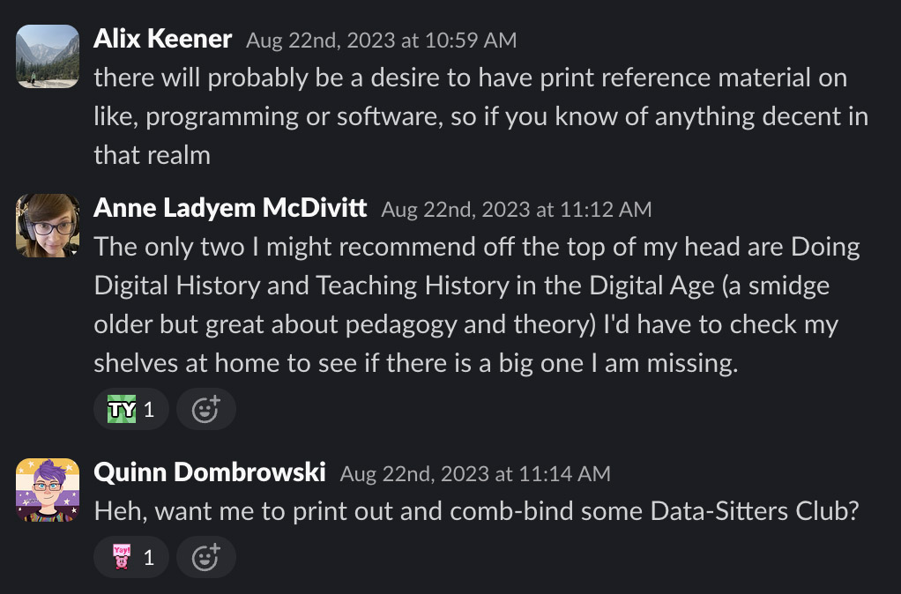
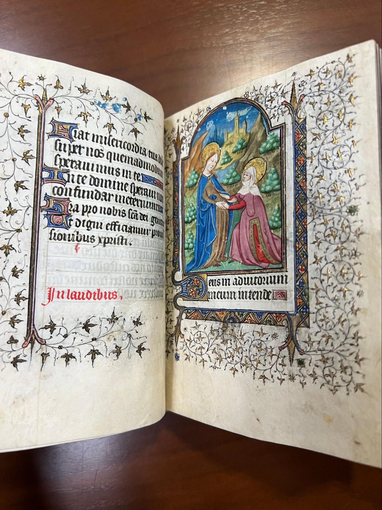
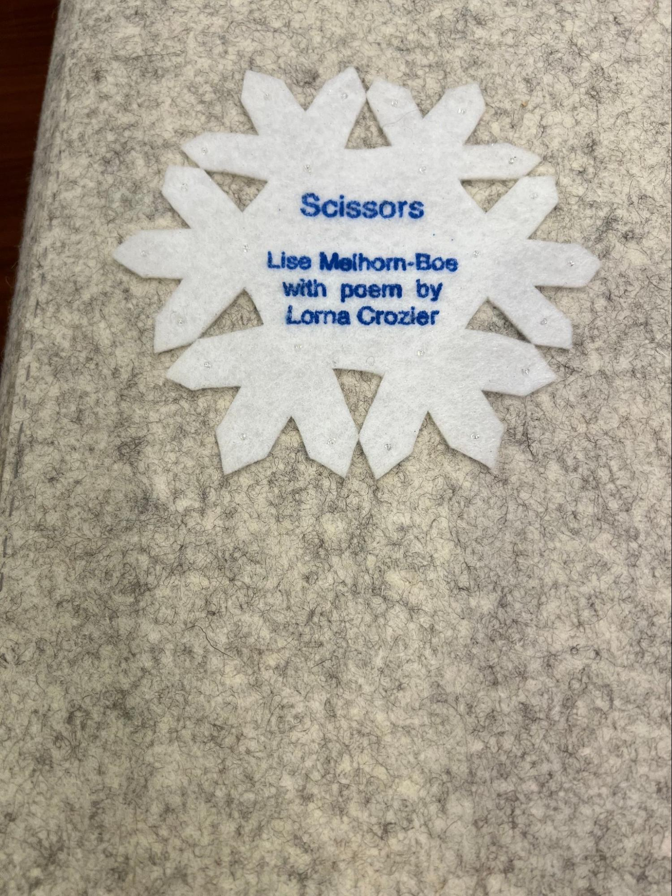
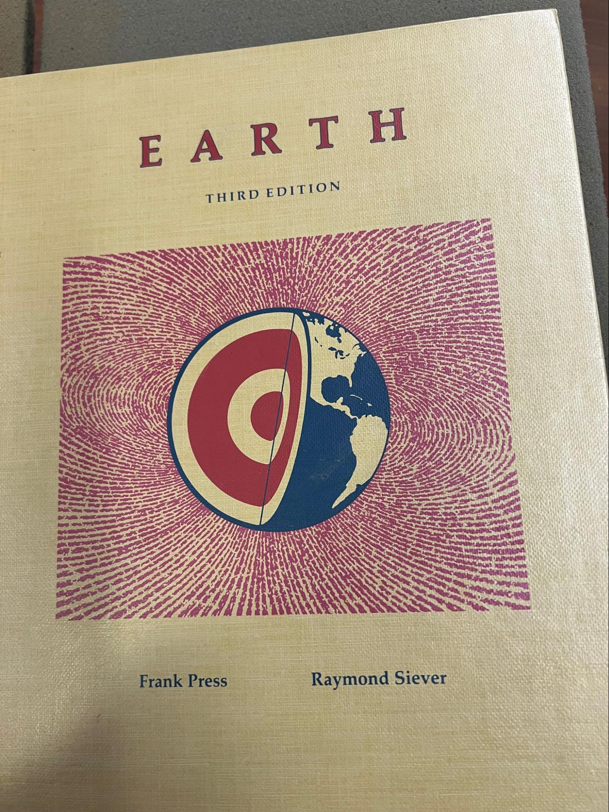
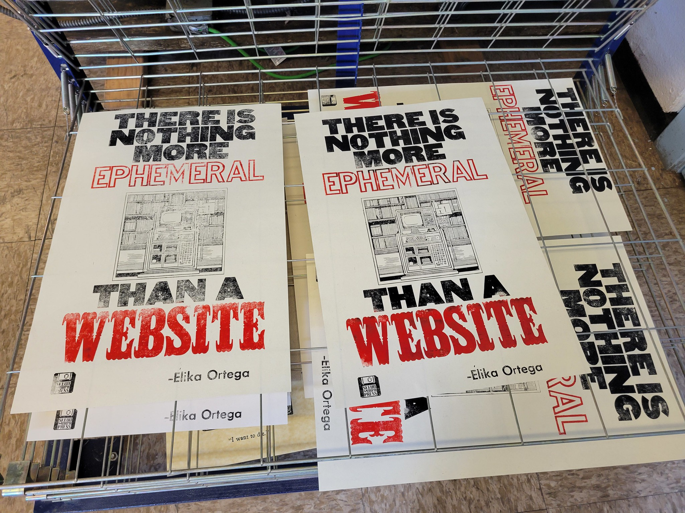

# DSC \#22: Lee Skallerup Bessette, Zine-Sitter

```{index} single: *Book Topics ; Zines (DSC 22)

```

by Lee Skallerup Bessette, Quinn Dombrowski, Julia Evans, and Marie LeBlanc Flanagan

June 13, 2025


<div style="width: 300px;margin-left: 7px;margin-top: 0px;">

</div>

## Lee

*(Post-January 20th, 2025, addendum)*

Look, y’all. It’s ROUGH out there right now. The more things that are banned in our schools and our governments, the more resources like zines become relevant and important. Navigating reproductive health. Staying safe no matter your immigration status. Keeping so-called “DEI” knowledge and teachings circulating. Resisting. 

This was a fun and distracting project for me over the fall semester, pre- and post-election. Now, the urgency of what a zine can do and what it represents is more important than ever. I do get into it a little further down, but I did want to reiterate that while zines are fun, they are also very serious and a powerful tool of resistance. 


## Quinn

It all started with a sarcastic comment in August 2023. Alix Keener, then the Digital Humanities Coordinator in Stanford Libraries and CESTA (our local DH center), had been tasked with filling the center’s bookshelves with DH reference books[^1], especially reference material about coding. In a fit of snark, I offered to just print out some of the Data-Sitters Club books for her.

[^1]: Do you know that thing that happens in institutions where some notion catches on and then everyone starts doing it? August 2023 was big at Stanford for the idea of buying paper copies of DH books and putting them on shelves in big empty spaces so that people would physically show up in those spaces in post-COVID times to consult the books. Needless to say, this did not work.



We've written about the usefulness of Jupyter notebooks as a publishing platform, both in [DSC 8](https://datasittersclub.github.io/site/dsc8.html#index-13) and (unusually for us!) in a [recent peer-reviewed article](https://journals.publishing.umich.edu/jep/article/id/6093/). Printing out the PDF version that you can download at the top of the web interface isn't actually a super satisfying substitution -- even though it **is** what I have in my institutional repository as a backup if we ever stop maintaining our website. But the more I thought about it, the more I found myself wondering what a meaningful format shift could look like. And that's what brought me to zines.

```{note}
   
*From, [What is a Zine: A Punk Revolution in Self-Publication](https://artincontext.org/what-is-a-zine/):*

> The term "zine"  is pronounced as "zeen", similar to how one would pronounce the word "magazine" in English. A zine refers to a self-published, small, or noncommercial booklet, which is created by an individual. These small publications can take the form of different sizes, formats, and shapes, and cover a variety of topics. Zines can be produced in a variety of ways using a photocopier or as printed offsets, such as newspapers or magazines.

> These publications offer a great deal of range for artists to express themselves and engage in general and niche discourses that speak to their intended audience. Artists and other creatives can use zines to relay information, sharing their unique perspectives on the world while forming connections with those who share the same interests. A more formal definition of a zine follows the guide that its circulation must fall under an edition of 5,000 copies or less, while the majority of artists usually create under 1,000. Another major characteristic of zines in the traditional sense is that these publications are often not created for commercial purposes, although they may be sold as such by artists who choose to do so.

As the cost of producing text on paper came down, the rise of small, self-published works rose. You can trace the history as far back as pamphlets in the late 19th century, but the booklet format gained popularity in the 1920s during the Harlem Renaissance with a publication called Fire!! Early on, zines were also popular in the science fiction communities. They have always been used to connect smaller, marginal communities, providing inspiration, resources, and an outlet for outrage and resistance. There are queer zines, feminist zines, Latinx zines, labor zines, Black zines, anti-fascist zines... In the Soviet Union and Eastern bloc, a related practice called samizdat (or self publishing house) developed in the late 1950s; this practice became a major means of creating and circulating dissident texts, from political and philosophical essays to novels (like Boris Pasternak's *Doctor Zhivago*, among others) and poetry. It grew out of the avant garde book culture, basically a form of zine culture, from the early twentieth century.

(Want a great collection of culture, technology, and justice zines? Check out Amanda Visconti's [Zine Bakery](https://zinebakery.com/)!)

```

When it comes to programming zines, the person who immediately comes to mind is Julia Evans, who started [Wizard Zines](https://wizardzines.com/about/) nearly a decade ago. Her zines and [comics](https://wizardzines.com/comics/) tackle both highly technical stuff (like the [inodes](https://wizardzines.com/comics/inodes/) that plagued me during my time helping run an HPC cluster) and very human stuff (like "[When debugging, your 'attitude' matters](https://wizardzines.com/comics/attitude-matters/)"). I loved Wizard Zines before I started the Data-Sitters Club, and while I wasn't thinking about it explicitly at the time, I'm pretty sure it was among the inspiration bouncing around in my head back then. So it was with much excited fannishness that I asked Julia Evans if we could interview her, and made time for a conversation with me and Lee in December 2024, along with Julia's collaborator [Marie LeBlanc Flanagan](https://marieflanagan.com/about/).

Everyone has their own personal story for how they first encountered zines; mine runs through my high school underground literary magazine [I.E.: Insolence is Excellence](https://archive.org/search?query=subject%3A%22IE%3A%20Insolence%20is%20Excellence%22). (I scanned the 10 volumes I owned and put them up on the Internet Archive.) 

For herself, Julia explained,  "I watched a movie called "Girls to the Front" that was about riot girls, around 2012 or 2013. I always wanted to be a writer, but was too scared to write for the school paper. I liked the idea of independent publishing, but I never did anything about it. But I was going to be giving a conference talk and thought I could make a zine for the talk, print out 200 copies, and give them to everyone in the audience. It seemed, somehow, like the obvious thing to do. There was a clear deadline, a clear scope, it was on one of my favorite tools ([strace](https://strace.io/)), so I just made it with a Sharpie and photocopier. People loved it, and I figured I could keep making zines about stuff I thought was cool. But from then I switched to using a tablet because it was kinda hard with the photocopier."

"What's your process like?" I asked. "Do you write things first and adapt them into zines, or do your zines just start out that way?"

"That first one and the next, '[So You Want to Be a Wizard](https://wizardzines.com/zines/wizard/)', were very connected to talks I was giving," said Julia. "But I guess for me, there's 4 media I work in: tweets, blog posts, talks, and zines, and they're all kind of different from each other. Blog posts are kind of like thinking about thinking about an iea: I don't worry so much about who it's for, I just write things that I think are cool -- and people read it or they don't. But with the zines, there are rules."

"With the zines, you take big concepts, lots of words, and you distill them down to something that feels more human," Marie chimed in. "It feels more spoken, more concise, more energetic. It's the same with code."

"Yeah, we do put code examples in the zines, and it's a nightmare because they don't fit," mused Julia. "So we really need to edit them down. We even have to lie sometimes. Like, if there's an error message, I'll try to just communicate the essence of it because the error message was like thiiiiiiis big." We laughed as Julia stretched her hands out, as if the error message she'd caused were a particularly laudable catch while fishing. We've [been there, too](https://datasittersclub.github.io/site/dsc21.html#troubleshooting-environments). "So we won't write out the message, but we'll talk about how you might feel about it."

"And make a joke," added Marie. "But that's where the blog post comes in: that can be as long as it needs to be, and Julia can put all the error messages there, but on the zine it has to fit into a little box. But it's not like Julia writes blog posts and then adapts them into a zine. More like we're exploring a topic, and that might generate some blog posts when Julia goes on these incredibly deep dives of hyper-focus into something then comes back. And eventually there could be a zine on the topic."

"Sometimes it helps to see how people respond to the blog post," Julia said. "That tells me what resonates with people emotionally, like how the words in git are confusing. It's hard for me to tell sometimes what things are hard and why, when it's something I work with that's easy for me but I realize it's not easy for other people."

"I've kind of always been into zines," explained Marie, when I asked about how they and Julia collaborate. "I make experimental video games, before that I ran a music and experimental community called Weird Canada. I taught myself to program maybe 6 years ago, and I met Julia because she had a pen plotter and wanted to make a pen plotter game. I designed a feedback site for the zines, where you can click different places on the page and add a lightbulb to say you learned something, or a heart to say you loved something. It was a lot better than having people email us with feedback on this or that page. And it helped us divide people's feedback into useful, meaningful information we could actually do something with. Like, sometimes people say they're confused, but actually what they're saying is they didn't like the way something was presented. Or they'll say they like it and learned a lot, but actually didn't learn anything -- they just thought that was how someone else might learn it."

"We load in the material as we're writing it -- we'll write a draft of a zine then send it to 30 people and ask them to leave comments," said Julia. "The goal is always to get light bulb emojis -- that's what we're trying to get to. Hearts are good, hearts are okay, but..."

"... if we get a whole page of hearts, we're *not happy*," Marie said.

"Yeah, if people are just like, 'Oh, I like it!' but they didn't learn anything, that's not good. Then we go through the feedback and try to turn them into something that actually is useful."

"How long does it take you to make a zine?" I asked, adding, "I know that's a hard question..." thinking about the fact that more and more of our recent DSC books have taken well over a year.

"It gets longer every time," admitted Julia. "I think right now, we've released like once a year?"

"We've talked about making microzines and getting back to something really small," said Marie. "But whenever we open a can of worms it just gets bigger and bigger. Like, the one we're working on now was going to be a microzine."

"Yeah, that's true," grimaced Julia. "No, now it's gigantic. It just takes more time. I think they're getting better. We wrote this one called *[The Pocket Guide to Debugging](https://store.wizardzines.com/products/the-pocket-guide-to-debugging)* -- that one was a really big hit. And I think it really helped people. I think it was worth spending a year on it. We've also done other things, like this playground, *[Mess with DNS](https://messwithdns.net/)*. And the reason this is important to me is that, what does it even mean to talk about something on a computer? The whole point of computers is that you're doing stuff. So, how do you do the stuff? With something like DNS, it's intimidating and people are afraid of messing it up. So we give them a space to do that, and also try to make pieces of the invisible internet visible, like showing what DNS provider you're using."

Lee and I happily played in the DNS sandbox for a while before remembering we were there to talk about zines.

"What is it about zines for you-- this modality, this genre of publication?" asked Lee.

"I feel like print always seems somehow magical to me, " said Julia. "If I have a thing, and I can give it to someone, I feel like it gets my attention in a way that digital things don't. There's so many digital things in my life, the idea that *I can have this and give it to someone I don't know* -- it's very exciting. I'm also obsessed with blogging, and I feel like with computers, people write in a very impersonal way. But it's always so much easier for me to understand something when I understand how other people are relating to it. Like DNS -- how has it ruined your day, specifically? What are the most common ways it ruins people's day? How has this gone wrong for you? Technology by means of people's personal stories with technology. You can learn so many more interesting things. Zines are a really good format here for telling a personal story."

"For me, like Julia, it's a physical thing you can touch," said Marie. "The information online can feel kind of infinite, but a physical thing in my hands feels finite, and it's here right now. Part of how my brain works is there's right now, and nothing else. There's a future, kind of, but it's not like here, right now, and this one concrete thing. I love zines, I love subculture, and riot girl culture, and DIY culture. People taking their own story, and their own knowledge, and saying, 'I'm going to put this to paper because we have the technology.' We're putting the care in. Being concise means a lot of work on our end to make sure it's something small and beautiful, so the readers aren't spending 10 hours on sorting it out. They get to spend one minute looking at it and learn something. It's an act of love to the reader to do that, to be concise and clear and real."


## Lee

Barnard Library keeps [an international list of libraries with significant zine repositories](https://zines.barnard.edu/zine-libraries). If you search for ["zines" in Google Scholar](https://scholar.google.com/scholar?hl=en&as_sdt=0%2C9&q=Zines&btnG=&inst=6453202103507108275), you get over 234,000 results. But why, recently, has there been resurgence of interest in zines and zine production? What is it about our currently cultural and historical moment that is drawing us towards making and exchanging zines?

Lee:

Settle in, because I'm going to tell this story full-on ADHD style. It's August 2024, and I'm psyched for DH2024, which is taking place almost literally in my backyard. I haven't seen a lot of these folks since before the pandemic, in Montreal for DH2017 (OMG). I am taking advantage of going to every day of the conference, all day, every day. I have warned my family that I am unavailable for that week to do anything. No driving anyone anywhere. No making meals. No refereeing arguments. NOTHING. We didn't take a vacation this summer for a variety of reasons, and this was the closest I was going to get.

I am also getting ready to get back into the undergraduate classroom, teaching our iteration of First-Year Writing. I know I want students to think critically about technology, but outside of that vague idea of a theme, I (of course) have done little to no planning. And finally my procrastination pays off; I get no less than five resources/assignment ideas, but the lightning really struck during the #DHmakes session where they talked about zines. That was it. My students' final assignment was going to be to make a critical tech zine.

(You can see [the full schedule/syllabus for that course here](https://coursesites.georgetown.domains/writ-1150-16-fall2024/).)

I loved the idea of having the students make something with their hands; even if they create the entire zine electronically, they would still have to print and assemble it. I also liked the idea of ending the semester with something a little more fun and playful during a time where I knew the students would be the most stressed out. And as much as I appreciate electronic submissions and Speedgrader in Canvas, I miss holding a student's work in my hands. In true ADHD fashion, I became *obsessed*. 

I reached out to [the Maker Hub](https://library.georgetown.edu/makerhub) on campus, and he put me in touch with [Special Collections](https://library.georgetown.edu/special-collections) WHO HAS A COLLECTION OF ZINES AND ART BOOKS ABOUT SURVEILLANCE. Y'all, this was perfection. PERFECTION.

Given this current obsession, I was thrilled to be able to work on this book on zines for the Data-Sitters Club. I think there is a lot of overlap between what zines are and represent and the original Baby-Sitters Club, as well as what we're doing in the DSC. The Baby-Sitters Club books embraced a DIY and low-tech sensibility - the hand-made fliers, the hand-written journal entries, the craft boxes that they brought with them on sitter jobs. 


Our DSC "books" are a digital DIY, but also radical in their approach to digital humanities (a topic I tend to go on and on and on and on about - TAKE GIRL CULTURE SERIOUSLY YO! DO NOT BE AFRAID TO FAIL!). So a DSC zine would seem to be a logical next step.

Zines, like so many other things I love dearly, are deceptively simple: a couple of sheets of paper ([or even just one!](https://tinkerlab.com/how-to-make-a-book-from-one-piece-of-paper-no-glue/)), a writing implement, and maybe some scissors, and you have all you need to make a zine. Except, of course, deciding on the content. What is the zine for? These questions are the same no matter what kind of "book" you're looking to create: Who is the audience? What's the purpose? What are the rhetorical strategies that could be used? What are the affordances and limitations of the media?

In other words, why should we adapt something that we've done at DSC into a zine? What would that look like? Would it be effective?

Looking for guidance, and hoping to inspire my students, I took my class to the library to look at zines and other related types of "books". We started with medieval manuscripts because these were the OG handmade books! Hand-made paper, handwritten, hand-illustrated, hand-bound, hand-covered...Because Georgetown, some of my students practiced their Latin translation skills! But also, if no one knows what a book is supposed to look like, what did we decide to do?

  

Next, we moved on to some pretty cool art books about surveillance, censorship, and oppression. First up, [The Record by Anne Covell](https://annecovell.com/store/the-record), an interrogation of what government websites disappeared at the beginning of the (first) Trump administration (the site has better pictures and a description of the project).

  

A more recent one by Covell, [In The Dark](https://annecovell.com/artist-books#/in-the-dark). I included a photo of the artist's statement (which you can also read on the site), but the whole thing is a genius work of art.


Then, [The Seeing Machine by Millicent Krebs](https://www.instagram.com/p/Cox9m8KPI6m/?img_index=1) who juxtaposed posts from NextDoor with parts of *The Panopticon*.

  

This one was particularly haunting - [In Their Memory, Human Rights Violations, Chile (1973-1990) by Maria Veronica San Martin](https://wrlc-gu.primo.exlibrisgroup.com/permalink/01WRLC_GUNIV/15eloc1/alma991038083622504111). The [video](_static/images/dsc22_intheirmemory.mov) doesn't do it justice, but you get the idea.


This book made from textiles made me think of Quinn - [Scissors by Lisa Melhorn-Bos with poems by Lorna Crozier](https://wrlc-gu.primo.exlibrisgroup.com/permalink/01WRLC_GUNIV/15eloc1/alma991037847129504111).



Finally, [Earth by Sara Press](https://wrlc-gu.primo.exlibrisgroup.com/permalink/01WRLC_GUNIV/15eloc1/alma991038028229804111), whose grandfather was President Carter's science advisor and an early figure who was concerned about climate change. This book is made from her father's geology textbook.

  

Why show and share these books with my students (and you)? Well, it’s cool (and definitely cooler to get to hold them and leaf through them and experience them, so hit up your rare book librarian and see what your library has!). But also, when we think of books, when we think of protest or acts of resistance, we don’t typically think of the examples we were shown. I wanted to inspire the students to think creatively about their zine and how they choose to engage critically with technology. 

OK, so now it’s time! We come to…the artifacts that can in fact be called zines in the truest sense of the word! 

    

One that I didn't take a picture of because my students kept wanting to read it was a 200-page (!!!) manual about disappearing and surviving off grid in the wild. The pages were formatted to look like a 1990s textbook (the font selection alone gave me flashbacks to high school) . If it weren't for the fact that it was clearly photocopied and roughly stapled together, to some it would barely be considered a zine! Being Seen/Being Watched is a reprint in zine format of an article published online in [Model/View/Culture](https://modelviewculture.com/). Some had authors, while others didn't.

I particularly love the zines about (not) engaging with the police, and while they aren't recent, [the advice is evergreen](https://bsky.app/profile/buny.bsky.social/post/3lablquxp4a2n). Some of the zines dealt with how to know if your phone has been tapped and what to do (which, not terribly relevant) while others on remaining anonymous are still relevant, if not engaged with the most current technologies. Again, this is the strength of zines as a format, because it is relatively easy to produce an up-to-date version quickly. And why does my library have so many zines on privacy, security, and surveillance? We have a special collection (and funding!) on Military Intelligence & Espionage Multimedia.\
As we talked about the zines, the rare books librarian, Jay Sylvestre, noted that it would be easier for him to replace the medieval manuscripts than it would be to replace any of the zines; the manuscripts themselves were non-descript and used as exemplars of the various types of medieval books and how they were put together. And the manuscripts were built to last, made from animal skins or cotton rags, bound with heavy thread, and covered with sturdy materials like leather. The zines? Not so much. If [there is nothing more ephemeral than a website](https://elikaortega.net/blog/2025/theres-nothing-more-epehemeral/) (I have the poster, would very much like the t-shirt and laptop sticker next), then zines are a very close second (followed in third place by cheap, mass-market paperbacks, but I digress).



So there is an inherent tension in zines: on the one hand, the are important culture and historical artifacts that preserve moments, movements, and communities, and on the other hand, they were meant to be easy to get rid of and hard to track or trace in service of the protection of said moments, movements, and communities. The archival researcher in me wants to collect every last zine that exists for posterity and future research, as well as many of them being works of art in their own right. Another part of me is sympathetic to the ethos of being allowed to be, if not forgotten, then at least be allowed to remain underground, away from the algorithms, the surveillance state, the content-starved.

The zines the students in my class turned in were, as I expected, brilliant. I did [a thread on Bluesky](https://bsky.app/profile/readywriting.bsky.social/post/3lcxzh4xgj22i) featuring their zines. [I also did my own zine arguing against parents surveilling their kids](_static/zines/readywriting_surveillance_zine.pdf).

So I come back to the question, why zines for the Data-Sitters Club? Or rather, what zines?

Honestly, we could just print out our DSC books formatted as zines and be done with it. We could cut out all the fun stuff and print how-to zines. We could do a full-on adaptation for the new medium, hand-written with mixed media. We could do a mix of all three! And, like so many of our DSC projects, the "why we want to do this" is a little bit fuzzy: BECAUSE WE CAN! SLOW DH! MAKE THINGS WITH OUR HANDS! DO NOT FEED THE AI MACHINE! SUBVERT! This makes deciding on what kind of zine to create a little more challenging.

But then I thought, what the heck! Let's just make all the zines.

After some discussion in the WhatsApp DSC group chat, we decided to try [DSC #11: "Katia and the Sentiment Snobs"](https://datasittersclub.github.io/site/dsc11.html) as a straight up zine reproduction. I decided to do the least amount of work, so I took advantage of the option at the top of every book to export it as a PDF.


I also decided that I wanted the cover to be, well, the cover, so I downloaded the image, turned it into a PDF (more on why in a moment), used Preview to merge the two documents, and then fed the PDF into the Mac app [Spectrolite](https://spectrolite.app/). It's a booklet/zine-making app that takes a PDF and changes it into a zine of the page and booklet-type that you want.

And, [here are the results](_static/zines/dsc11_pdfversion.pdf)! And the resulting zine is...fine? The file is formatted to be printed double-sided and then turned into a booklet.

Here's where we get into the issues of affordances. First, it's black and white. There is an exported color version, but that app (rightly) assumes that you won't be mass-reproducing a zine in color. This doesn't matter for a lot of the images we included, but when it comes to charts or graphs where color matters, well...It doesn't work so well. Then, there are all the lines of results. On an endless scroll, well, it doesn't matter too much, but as a book, it becomes a little more complicated. Admittedly, I didn't do much other than "print as PDF" rather than taking the online book, pasting it into, say, a Google Doc, reformatting it, and then printing as a PDF. I really did just want to do as quick and dirty a zine adaptation as possible.

Now, why would you want to do this? Well, maybe you want to share information with people who are worried about their browser history being tracked, like people seeking an abortion and reproductive healthcare, members of the LGBTQ+ community who are fearful of coming out and seeking information, the undocumented, people looking to leave abusive partners...There are lots of people who would benefit from having already-available online resources as a zine because their web searches/histories are surveilled.

Or, you know, you could pass around information like the stuff found here on the [Tools for Democracy, Antifacism, and Justice by Chad Topaz](https://chadtopaz.com/tools-for-democracy-antifacism-and-justice/). I, for one, think that [How to Fuck Up an Asshole School Board](https://docs.google.com/document/d/1RmInjFNVs3guetDErrkoqDQrJc91IOpJ9WoXmSRwIA0/edit?tab=t.0#heading=h.luhf7nu8x5wf) or [Technology-Empowered Citizenship](https://docs.google.com/document/d/1vIWlAOhdYS4kYDALPxUVwyUeJ2ppgZjtgiXwCJgNu80/edit?tab=t.0) would make for some kick-ass zines.

Next up, no fun stuff, just a how to. So, let's look at [DSC #12: "The DSC and the New Programming Language."](https://doi.org/10.25740/wr764jc8892) Without any real fun stuff, we end up with [a perfect 8-page zine](_static/zines/dsc12_pdfversion.pdf). Again, the color in those graphs won't really pop as a printed zine, but if I took all the survey stuff out, it would still have been five pages, which isn't ideal. But if you're looking for something quick and easy to print out and give to students or aspiring digital humanists, this would work well enough.

Except, the fun stuff in this book is fun. So, here is [Coding Stories: The Zine](_static/zines/dsc12_coding_stories_fun_stuff.pdf)! I did a lot more editing to this one, as I shrunk most of the images so that I could include a full-page "tear-away" sheet on the back page, with a QR code and bit.ly that brings you to a form where you can contribute your own coding story! Shades the old page you could tear away to send away for something or join the fan club!

So far, all of this has been pretty straightforward taking already existing text and images, turning them into a PDF that is then formatted into a zine. Sure, I added a QR code and resized some images, but ultimately, these adaptations haven't really embraced the DIY, maker spirit of zines. Part of it, for me at least, is that the act of adaptation isn't easy. Or at least it isn't as easy as what I did here. Perhaps it is a lack of confidence in my own creativity, or laziness, or probably both, but I read and reread all of the DSC books and was like, I don't even know where I would start.

And in some cases, that's ok! Why do the work twice? If what you need is exactly already in a format that can pretty straightforwardly be turned into a zine, why not? Splitting up DSC #12 ended up with two very specific zines that serve two different, but still useful, purposes. If we had asked each person to tell their coding stories for a zine, it probably would have been different, but for now, this is good enough for my purposes.

But I do want to show how zines can be creative and fun, not just a convenient way to print and share things. So in that spirit, to get ready to write the next TL;DR, I present to you, the [So You Want To Make A Corpus? zine](_static/zines/dsc_corpus_zine.pdf)!

 

And that is the power of friendship, right there.

I started by identifying the relevant DSC books that could be useful for someone getting started on building a corpus: 

* [DSC #2: Katia and the Phantom Corpus](https://datasittersclub.github.io/site/dsc2.html) - Best practices for digitizing a corpus.
* [DSC #7: The DSC and Mean Copyright Law](https://datasittersclub.github.io/site/dsc7.html) - Understanding how you can work with your corpus within the limits of the law.
* [DSC #14: Hello, DMCA Exemption](https://datasittersclub.github.io/site/dsc14.html) - More advice on the shifting copyright landscape.
* [DSC #17: Cadence's Archives Mystery](https://datasittersclub.github.io/site/dsc17.html) - If building your corpus involves doing archival research.
* [DSC #18: The Data-Sitters' HathiTrust Mistake](https://datasittersclub.github.io/site/dsc18.html) - Working within an already-existing corpus.
* [DSC #19: Shelley and the Bad Corpus](https://datasittersclub.github.io/site/dsc19.html) - Examining the limitations of a given corpus.
* [DSC Multilingual Mystery #1: Lee and the Missing Metadata](https://datasittersclub.github.io/site/dscm1.html) - Hunting down potential missing metadata for your corpus.
* [DSC Multilingual Mystery #3: Quinn and Lee Clean Up Ghost Cat Data-Hairballs](https://datasittersclub.github.io/site/dscm3.html) - Cleaning metadata for your corpus.

That gave me 8 books, and at a book per page, would perfectly fit into a two-page, folded zine, but then there wouldn't be a nice cover (which we are known for) or any space for an introduction, etc. So I went with a three-sheet, 12-page format. Distilling each book down to a page was a challenge, but I decided to print out one or two essential pull-quotes from each of the books to give a TL;DR take-away for readers, with a link to the book itself somewhere on the page so that a reader can easily find the full book to read. I also added my own editorial comments in handwriting, for added context (and flavor!).

I started organizing the books around what topic they addressed: #2 and #19 are about corpus formation, #7 and #14 are about copyright and fair use, #17 and #18 are about archives, while the two multilingual mysteries are about metadata. It didn't make sense to me to reproduce them inthem in the zine in publication order; you really should be thinking about things like copyright and fair use first before diving into making a corpus. The order, at first, was to be: DSC #2, #19, #17, #18, DSCM #1, #3, DSC #2, and finally #19.

And then I got to #19, *Shelley and the Bad Corpus*, and decided, wait, this should actually be third in the order.

After a lot of cutting, pasting, and reassembling, I had the order that felt right to me when it comes to creating a corpus. One huge issue I noticed when assembling the zine was that we never really explain anywhere in our books why metadata is important. We just...took it for granted, I guess? But having worked with faculty on DH projects, they often don't think about metadata or understand at first how essential it is to their work. So rather than try to find a quote that would work from DSCM #1, I tried, in one page, to explain what metadata is and why it's important. Maybe we need a whole book for that...

I think this topic lent itself really well to a zine format (and subsequent TL; DR) - I could provide enough to a reader to get them started, but also point them to where they could learn more, particularly when it came to coding, cleaning, etc. A how-to guide is particularly suited since it has clear purpose and parameters. The way we write most of our books, as well, makes it easier to adapt to this particular format: they are fun, yes, but also thoughtful and seek to answer the question why as well as the how. The how of each step is WAY too much for a zine (at least without some serious, serious editing - look at how "Katia and the Sentiment Snobs" turned out when it tried to print lines and lines of code and results!), but the "why" and the "so what" questions are suited to a zine format. This is also why the coding language zine was successful; the focus was on deciding on a language, not trying to teach it.

Going through the DSC archives, I could see [DSC #13: "Goodbye, Friends, Goodbye"](https://doi.org/10.25740/jq417jv3351) making a good zine (although I don't think any of us want to cry again in order to do it, so...). I could also see some of our more playful questions around the multilingual editions making a good zine (pictures of food!). I'm at a loss at the moment for thinking of other umbrella topics that multiple books would fit under, but I just made four zines in five days, so cut me some slack.

And finally, because I can't help but not be meta AF, [here is a zine adaptation of this DSC Book](_static/zines/dsc22_zines_zine.pdf). 

## Suggested citation

Bessette, Lee Skallerup. "DSC #22: Lee Skallerup Bessette, Zine-Sitter." _The Data-Sitters Club._ June 13, 2025.